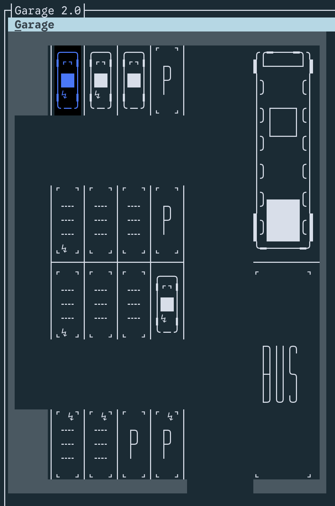

# Garage 2.0

A C# console application that simulates a multi-type vehicle garage. Park, remove, and search for vehicles across one or more garages with a grid-based layout.

Built as a C# exercise focused on generics, interfaces, and separation of concerns.



## Architecture decisions

- **Program → Manager → IUI / IHandler:** `Manager` wires the UI and handler together; it only ever touches interfaces.
- **`Garage<T>`:** generic collection backed by a private `GarageCell[,]` grid; implements `IEnumerable<T>` over parked vehicles.
- **GarageCell hierarchy:** `ParkingSpot` | `RoadCell` | `WallCell` — the 2D physical layout (only walls are impassable).
- **LayoutParser:** reads a simplified blueprint (`string[]`) and returns a fully configured `GarageCell[,]`.
- **SymbolRenderer / GarageRenderer:** convert a `GarageCell[,]` to multi-line ASCII art (`string[]`) — `SymbolRenderer` is a 1:1 unicode symbol map; `GarageRenderer` expands each cell to a 4×5 sprite block.
- **GarageHandler:** owns all business logic (park, remove, search, reservations, session history); calls through `IGarage`.
- **Two pre-defined layouts:** `MixedGarageLayout` → `Garage<Vehicle>` and `HangarLayout` → `Garage<Airplane>`.

## Phases

- **Phase 0 — Walking Skeleton:** project structure, abstract `Vehicle`, stubbed `GarageCell` hierarchy and interfaces, `Manager` wired through `IUI` / `IHandler`. App boots into a Terminal.Gui window.
- **Phase 1 — MVP:** concrete vehicle types, `ParkingSpot` with sub-slots, `LayoutParser`, two layouts, landing-view map (symbol map → 4×5 sprite upgrade), park / remove / find / search dialogs, `ParkingSession`, reservations, garage switcher, input validation.
- **Phase 2 — Stretch:** cursor-based interactive parking on the map, live as-you-type search, JSON persistence, vehicle-specific property filters, usage-stats dashboard.

## How to use

```bash
# Clone and run
git clone <repo-url>
cd 04-GarageProject2
dotnet run --project Ovn4-GarageProject2
```

Navigate the menu to park vehicles, remove them by registration number, or search by property.

## Docs

- [Class & sequence diagrams](Ovn4-GarageProject2/Docs/diagrams.md)
- [UI elements](Ovn4-GarageProject2/Docs/UI-elements.md)

## Dependencies

- [.NET 10.0 SDK](https://dotnet.microsoft.com/download)

No third-party NuGet packages are required.
